# MapMap - open source video mapping software

## Overview
MapMap is a free, open source software for projection mapping aimed at artists and small teams. Its intuitive interface facilitates learning and promotes artistic expression. This software is available on Windows, OSX, and Linux. MapMap gives users the ability to projection map on any surface of choice. Mapmap takes media sources and gives users the ability to manipulate the media into different positions and shapes. Media sources can come from any various accepted media formats. With an easy to understand interface, new users can get started in minutes.

Projection mapping, also known as video mapping and spatial augmented reality, is a projection technology used to turn objects, often irregularly shaped, into a display surface for video projection. These objects may be complex industrial landscapes, such as buildings. By using specialized software, a two or three dimensional object is spatially mapped on the virtual program which mimics the real environment it is to be projected on. The software can interact with a projector to fit any desired image onto the surface of that object. This technique is used by artists and advertisers alike who can add extra dimensions, optical illusions, and notions of movement onto previously static objects. The video is commonly combined with, or triggered by, audio to create an audio-visual narrative.

[Click here for a video demo](https://vimeo.com/177538718)


## Download and install

The latest version of MapMap can be find at these links:

- [macOS 0.6.1 DMG](http://download.mapmap.info/osx/MapMap-0.6.1-1.dmg) or [macOS 0.6.1 ZIP](http://download.mapmap.info/osx/MapMap-0.6.1-1.zip) - Note that macOS users need to also install [GStreamer](https://gstreamer.freedesktop.org/data/pkg/osx/1.14.0/gstreamer-1.0-1.14.0-x86_64.pkg) separately.
- [Linux APT repository](https://launchpad.net/~mapmap/+archive/ubuntu/mapmap)
- [Windows 0.5.0 installer](http://download.mapmap.info/windows/mapmap-0.5.0-x86-installer.exe)
- [Source code 0.6.1 tarball](http://download.mapmap.info/tarballs/mapmap-0.6.1.tar.gz)
- [Source code Git repository of MapMap](https://github.com/mapmapteam/mapmap)

Older versions:

- [macOS](http://download.mapmap.info/osx/)
- [Windows](http://download.mapmap.info/windows/)
- [Source tarballs](http://download.mapmap.info/tarballs)

## Launching the application
On macOS, open the application by either double-clicking on its icon in the Finder, or by clicking on its icon in the Dock.

On Debian or Ubuntu GNU/Linux, find its icon in the application menu and click it. You can also run it via the command-line by typing "mapmap".

On Windows, click on the windows icon and type in mapmap. Click on the MapMap icon to then launch the program.  

## Layout
MapMap consists of several different windows, icons, and menu options. The main windows are the Library, Layers, Input Editor and Output Editor.

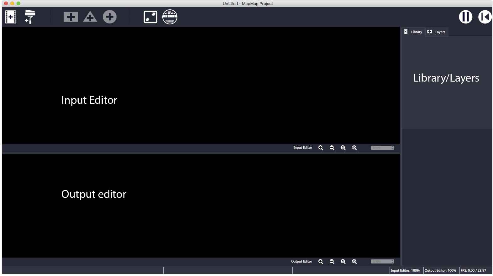

## Library
The Library contains the collection of sources that can be used in MapMap. The supported sources are:

- media files such as:
 - video (see preferred video formats below)
 - still images (PNG, JPEG, etc)
 - animated GIFs
- color paints/masks
- webcams (currently on Linux version only)
- ... and more to come in future versions

### Media Sources

Importing new media can be done in multiple ways:

- Clicking on File > Import media file...
- Hitting CTRL+I
- Clicking the icon in the toolbar
- Drag and drop media directly into library window

Preferred Video Formats:

- Containers: .mov, .avi, .mp4, .ogg, .ogv
- Video codec formats: Motion-JPEG / Photo-JPEG, MPEG4, Apple Pro Res 422

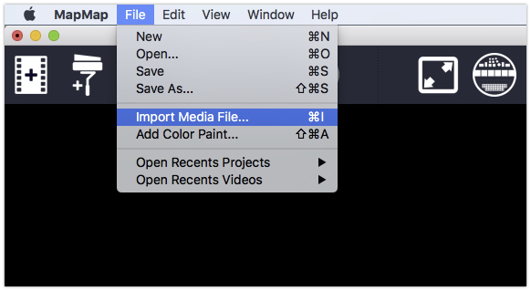

A introductory media / tutorial startup file can be found here: (INSERT LINK TO NEW MEDIA ? TUTORIAL ZIP FILE) 

### Color Sources

Adding color paints to the library can be done by choosing File > Add color paint or by clicking on the icon in the toolbar.

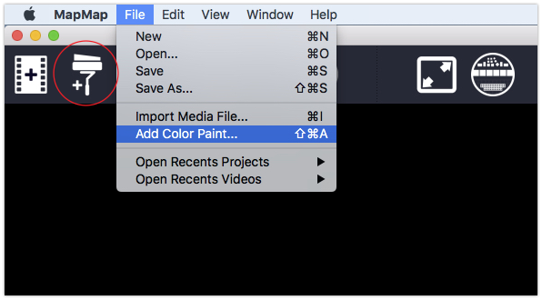

Once clicked on the following menu will appear once a color has been selected click “Ok” to add the color to the library. 

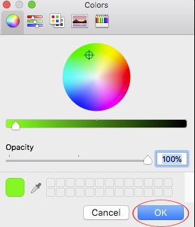

Media sources can be deleted by simply selecting it in the Library list, and then choosing the Edit > Delete menu item or by control clicking on a media source and choosing “delete source”. Since all the layers that use that source will also be deleted, a dialog will ask you for confirmation.

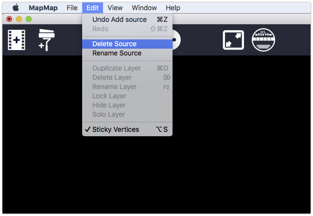

## Layers
To the right of the library tab is the layers tab. Layers are media sources that are displayed in the output editor. Layers are created when a source from the library is selected and turned into a 1. quad, 2. triangle or 3. ellipse. This tab allows users to show/hide, lock, duplicate, and delete layers. 


Layers can be deleted by selecting it in the layer list, and then choosing the "Edit > Delete" menu item.

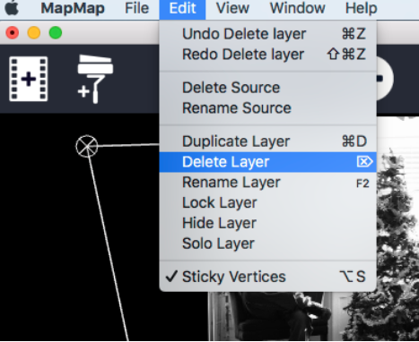

Layers can be rearranged by dragging them on top of or below each other. Doing this also controls the layer arrangement in the output editor. Layers add vertices to the source which allows the source to be edited in a variety of ways. 
Next to  each layer name, there are five icons:
1. Hide Icon:  This hides or shows the layer.
2. Isolate Icon: This isolates the layer selected.
3. Lock Icon: This locks or unlocks the layer so it can’t be modified.
4. Duplicate Layer Icon:  This duplicates a layer with all it’s settings .
5. Delete Icon:  This deletes the selected layer.

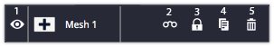

## Inspector
Below the Library and Layers tab is the Inspector menu.  This menu changes according to what is selected in the Library or Layers tab.  Through the Inspector menu, users can modify the selected source in a variety of ways. 
Options for the Layer Inspector menu:
1. Layer opacity can be changed on a 0 to 100% scale.
2. Video sources can be changed to any source in the library via the source drop down menu.
3. For Mesh Layers, there is an additional option titled “Subdivisions”.  This option is very powerful as it allows the user to add additional subdivisions to the original square shape.  These shapes can then be modified to create complex mappings onto a variety of screen shapes / geometries.
4. X and y vertices for each point of the input shape can be modified.
5. X and y vertices for each point of the output shape can be modified.

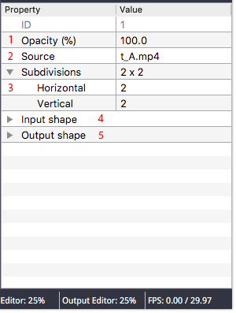

Options for the Library Inspector menu:
1. Source opacity can be changed on a 0 to 100% scale.
2. Source location can be modified by clicking on the … button so that a source can be swapped for another or relocated on the users hard drive.
3. Source speed can be changed on a 0 to 100% scale.
4. Source audio volume can be changed on a 0 to 100% scale.

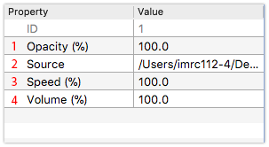

## Shapes
Currently supported shapes are: Quads/Mesh, Triangle and Ellipse. When Meshes have a dimension of two by two (2x2) vertices, they are called Quads. When they have more than 2x2 vertices, they are called A Mesh. A Mesh is a grid of vertices that allow more flexible mapping for complex output shapes.

To create a new shape,  choose a source in the library and click on Quad/Mesh, Triangle or Elipse icon.  A new shape will immediately be displayed in the Output Editor, where the size and shape of it can be manipulated by clicking and dragging it’s vertices.  You can also click on a vertices and use the arrow keys to make micro adjustments to its position. You can also use the number boxes in the inspector window to move the vertices manually. To turn a Quad into a Mesh, change its dimension changing its width, height, number boxes.

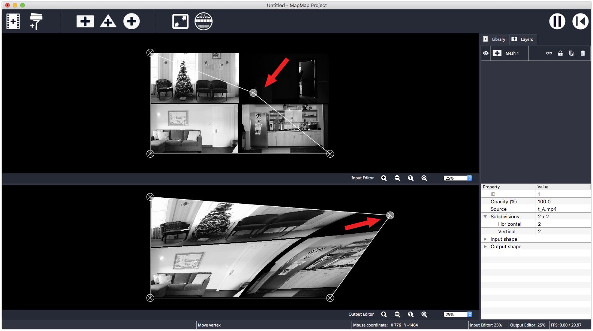

Shapes can also be transformed via a set of transform controls.  Click on a vertices and then use the following keyboard shortcuts to activate the controls.

M = Move

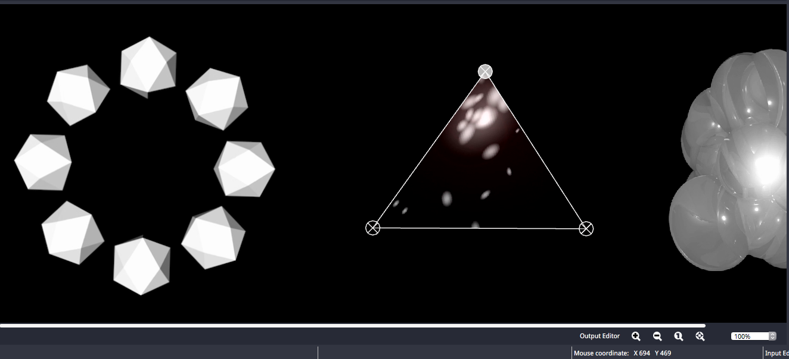

R = Rotate

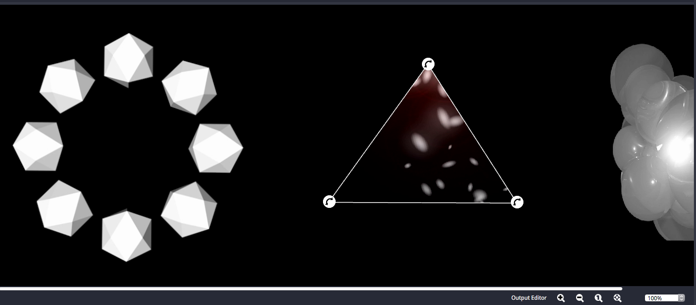

S = Scale

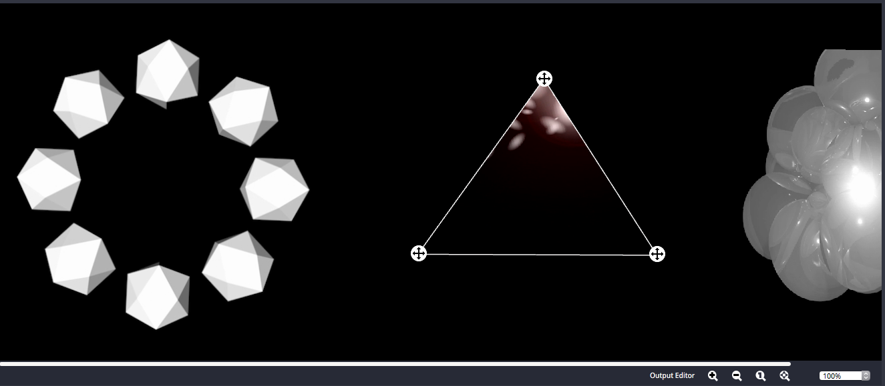

## Full Screen Mode
Before projection mapping onto a surface check the system preferences on your machine to make sure your computer is not set on mirroring, but instead is set so that your projector is an external / additional monitor.  Then use the Toggle Full Screen icon at the top of the MapMap Menu  to send the output editor content to your projector or external monitor. 


Special note for Apple Users: In your System Preferences > Mission Control.  Make sure that “Displays have separate Spaces” is clicked or you will have control issues when you go to full screen.

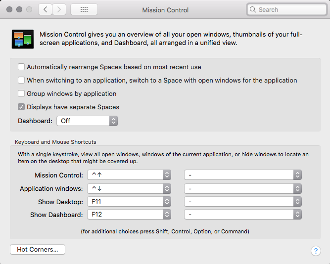

## Display Controls
Display Controls give the user the ability to select and move vertices both in the input and output editor menus.  To hide these controls click on the top menu "View” and then click on “Display controls".  Click on it again to re-enable Display Controls.

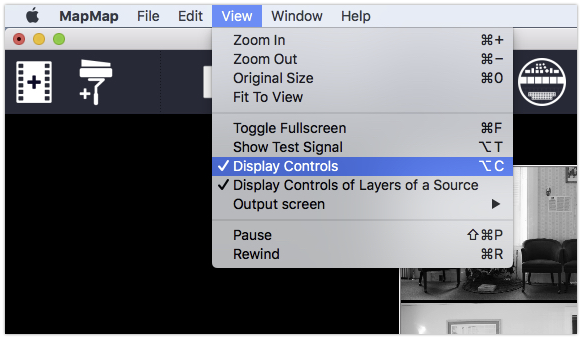

## Save the project to a file
To save the current project, choose "File > Save as..." and then choose a file name. The extension file is ".mmp", but the file format is simply XML, a very common one.

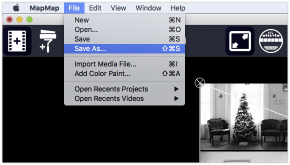

## Load a project from a file
To load a project from a file, choose "File > Open...".

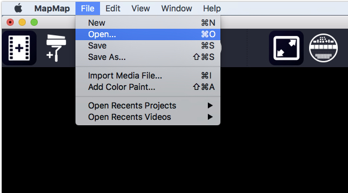

## External Control using OpenSoundControl (OSC)

IMPORTANT: This feature is currently not supported on macOS.

MapMap supports the [OpenSoundControl](http://opensoundcontrol.org/introduction-osc) communication protocol. Currently supported actions allow full control of existing sources and layers, such as changing a source file, adjusting opacity and visibility, changing volume, etc.

The default OSC port can be changed from the Preferences menu.

MapMap provides a flexible way to control groups of sources and layers using [regular expressions](https://en.wikipedia.org/wiki/Regular_expression). For example the following OSC message will change the opacity of all sources whose name starts with "movie-" to 50%:

```/mapmap/paint/opacity ,sf "movie-*" 0.5```

[Read the MapMap OSC reference](https://github.com/mapmapteam/mapmap/wiki/OSC)

# Support or Contact

To report a problem or suggest an enhancement please [open a new issue on GitHub](https://github.com/mapmapteam/mapmap/issues/new)

Other ways to reach us:
- [MapMap mailing list](https://listes.koumbit.net/cgi-bin/mailman/listinfo/mapmap-list-mapmap.info)
- The #mapmap IRC channel on Freenode
- Write to us at info at mapmap dot info

# Authors
- Sofian Audry: lead developer, user interface designer, project manager.
- Dame Diongue: developer.
- Alexandre Quessy: release manager, developer, technical writer, project manager.
- Mike Latona: user interface designer.
- Vasilis Liaskovitis: developer.

# Partners
MapMap is made possible thanks to the generous support of the following organizations:
- [Organisation Internationale de la Francophonie](https://www.francophonie.org)
- [Perte de Signal](http://perte-de-signal.org)
- [Ker Thiossane](http://www.ker-thiossane.org)
- [Conseil des Arts et des Lettres du Québec](https://www.calq.gouv.qc.ca)
- [Millumin](http://www.millumin.com)
- Alton ’38 and Adelaide Hamm Campus Activity Fund

# Troubleshooting

## macOS
To display more information about the errors that might occur, launch MapMap from the command line. To do so, open the Terminal application, that is located in /Applications/Utilities from Finder then type “ /Applications/mapmap.app/Contents/MacOS/MapMap”, and hit the Return key.
